<p align="center">
  
</p>

<h1>
<p align="center">
  
  <br>mTerminal
</h1>
  <p align="center">
    A modern, multi-tab terminal emulator with AI integration.
    <br />
    Linux · Windows · macOS
    <br />
    <a href="https://mterminal.dev">Website</a>
    ·
    <a href="https://github.com/arthurr0/mTerminal/releases">Download</a>
    ·
    <a href="https://mterminal.dev/docs">Documentation</a>
    ·
    <a href="CONTRIBUTING.md">Contributing</a>
  </p>
</p>

<!-- TODO: add screenshot

-->


## About

mTerminal is an Electron-based terminal emulator with real PTY sessions, multi-tab + tab groups, an encrypted credential vault (XChaCha20-Poly1305 + Argon2id), built-in AI integration (Anthropic / OpenAI / Ollama), an MCP server for local agents, and a typed extension API.

For more details, see [mterminal.dev](https://mterminal.dev).

> **Status:** alpha. Tested on Linux (X11 + Wayland), Windows 10/11, macOS 14+.

## Download

See the [download page](https://github.com/arthurr0/mTerminal/releases) or:

- **Arch / CachyOS (AUR):** `yay -S mterminal-bin`
- **Linux script:** `./install.sh`
- **Windows script:** `pwsh -File .\install.ps1`

## Documentation

See the [documentation](https://mterminal.dev/docs) for install, configuration, keyboard shortcuts, and extension API reference.

## Contributing

See [`CONTRIBUTING.md`](CONTRIBUTING.md). Quick start:

```bash
pnpm install
pnpm exec electron-rebuild -f -w node-pty
pnpm dev
```

## License

[MIT](LICENSE)
